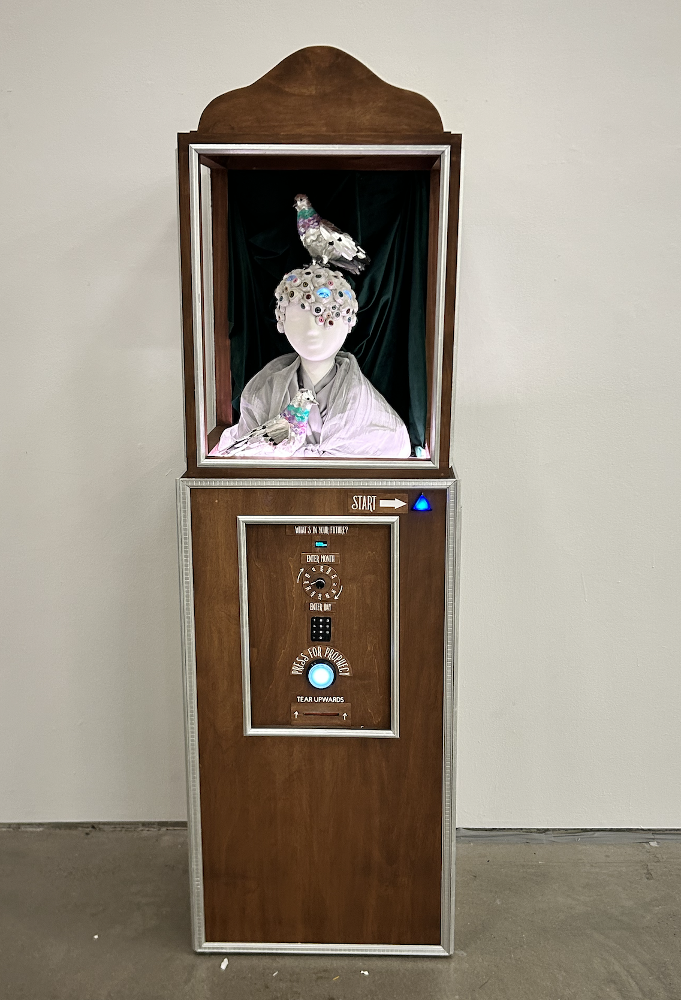

 

::: {.exhibition-layout}
::: {.exhibition-photo}

:::

::: {.exhibition-writeup}
#### The Oracle of Gotham

*Karissa Whiting & Elizabeth Costa*

The Oracle of Gotham is a machine-medium that mines cyclical rhythms in New York's urban data to channel prophetic messages from the city's collective unconscious.

A new ecosystem is taking shape: the Technosphere. Vast, self-reinforcing, and increasingly opaque, it weaves together data, algorithms, and AI-driven automation into a system no one fully controls. Urban systems are both shaped by it and continuously feed data back into it, yet its inner workings are largely inscrutable. Gaps between experience and understanding often give rise to myth, divination and the impulse to give the unknown a body. The Oracle of Gotham turns that ancient logic towards this new digital sphere.

Visitors are invited to request a prophecy from the Oracle of Gotham—a playful effigy of the Technosphere. Two pigeons perch on their shoulders, a New York City nod to the Oracle of Delphi eagles. Prophecies are constructed from the city's seasonal rhythms, emerging from a semi-automated process of mining NYC Open Data for cycles of growth, decay, and renewal. For each date, patterns from historic data (311 calls, arrests, rodent inspections, water quality, dog bite data) are extracted and sent to a large language model to generate short 'predictions' for next year.

Rather than practical forecasts, the oracle's messages are irreverent, sometimes nonsensical, challenging the paradigm that data-driven predictions are inherently rational or useful. Instead, these poetic distortions of real urban cycles may attune us to the city's cycles of activity and rest, abundance and scarcity, presence and loss.

**Data**

- 311 Service Requests, NYC Office of Technology and Innovation
- Rodent Inspection Data; Dog Bite Data, NYC Department of Health and Mental Hygiene
- NYPD Arrests Data, NYC Police Department
- Watershed Water Quality – Limnology, NYC Department of Environmental Protection
:::
:::
