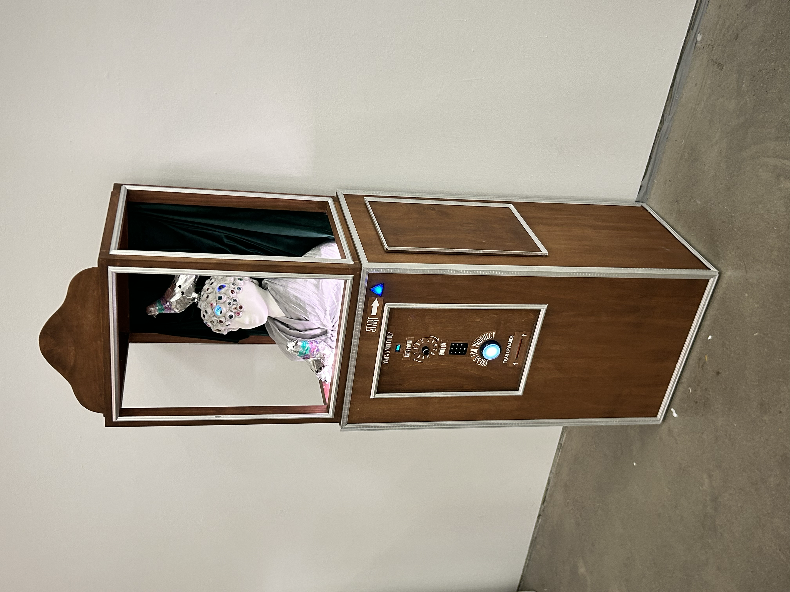
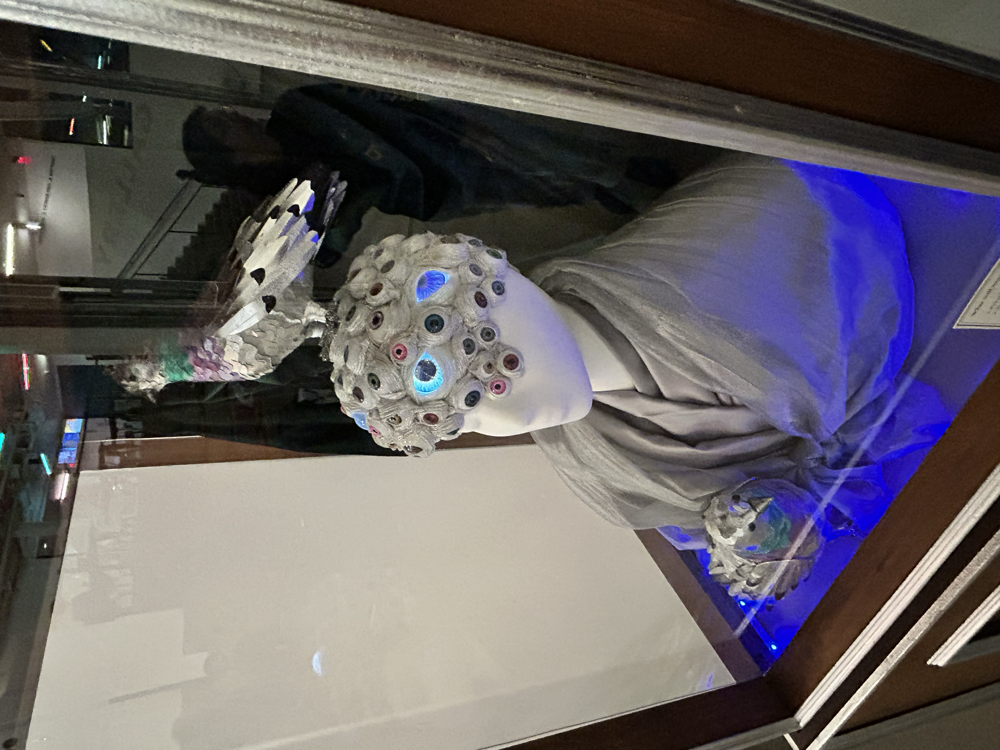
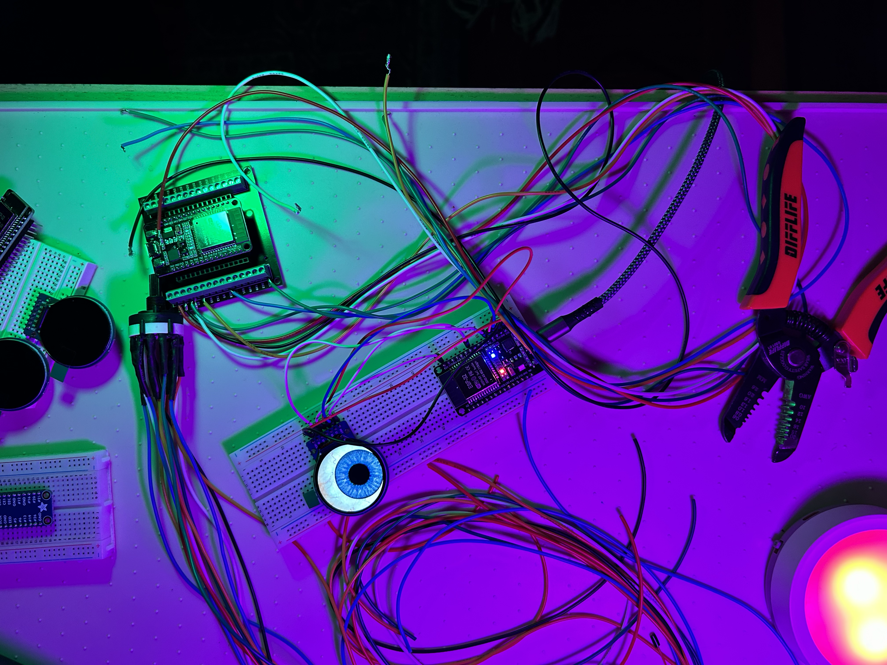
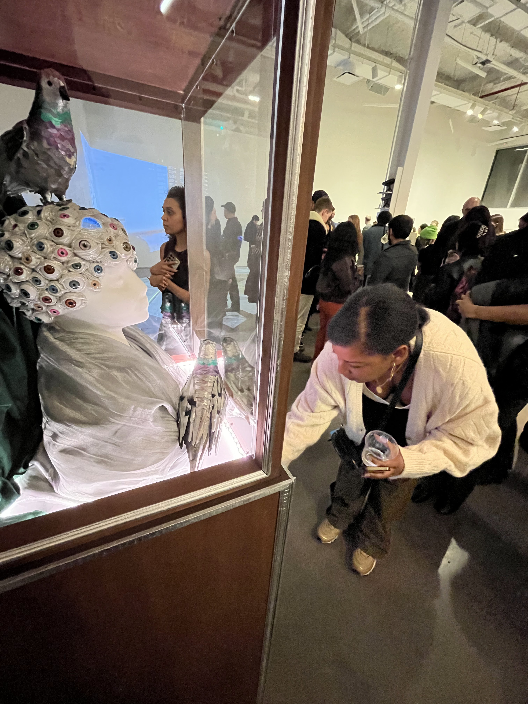
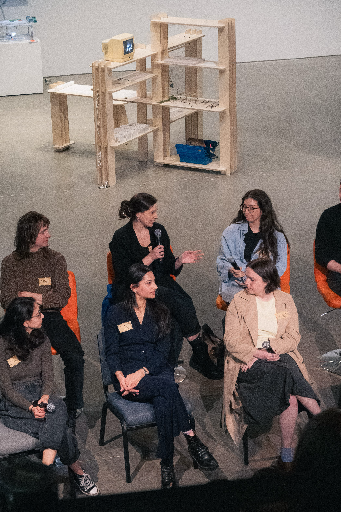
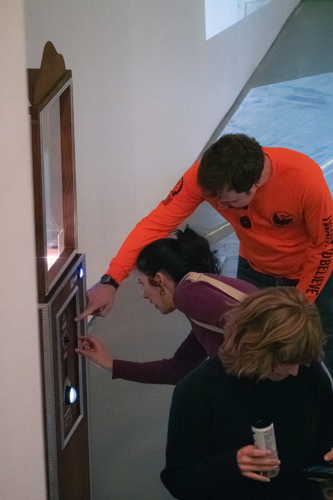

::: {.exhibition-layout}
::: {.exhibition-photo}
::: {#oracle-carousel .carousel .slide .exhibition-carousel data-bs-ride="carousel"}

<button type="button" data-bs-target="#oracle-carousel" data-bs-slide-to="0" class="active" aria-current="true" aria-label="Slide 1"></button>
<button type="button" data-bs-target="#oracle-carousel" data-bs-slide-to="1" aria-label="Slide 2"></button>
<button type="button" data-bs-target="#oracle-carousel" data-bs-slide-to="2" aria-label="Slide 3"></button>
<button type="button" data-bs-target="#oracle-carousel" data-bs-slide-to="3" aria-label="Slide 4"></button>
<button type="button" data-bs-target="#oracle-carousel" data-bs-slide-to="4" aria-label="Slide 5"></button>
<button type="button" data-bs-target="#oracle-carousel" data-bs-slide-to="5" aria-label="Slide 6"></button>
<button type="button" data-bs-target="#oracle-carousel" data-bs-slide-to="6" aria-label="Slide 7"></button>
<button type="button" data-bs-target="#oracle-carousel" data-bs-slide-to="7" aria-label="Slide 8"></button>
<button type="button" data-bs-target="#oracle-carousel" data-bs-slide-to="8" aria-label="Slide 9"></button>

::: {.carousel-inner}
::: {.carousel-item .active}

:::
::: {.carousel-item}

:::
::: {.carousel-item}

:::
::: {.carousel-item}

:::
::: {.carousel-item}

:::
::: {.carousel-item}

:::
::: {.carousel-item}

:::
::: {.carousel-item}

:::
::: {.carousel-item}

:::
:::

<button class="carousel-control-prev" type="button" data-bs-target="#oracle-carousel" data-bs-slide="prev">

Previous
</button>
<button class="carousel-control-next" type="button" data-bs-target="#oracle-carousel" data-bs-slide="next">

Next
</button>
:::

 

<a class="software-badge" href="https://nyc-oracle.github.io/get-new-prophecy.html" target="_blank" rel="noopener"> Consult The Oracle</a>

:::
::: {.exhibition-writeup}
#### The Oracle of Gotham

*Karissa Whiting & [Elizabeth Costa](https://elizabethcostadesign.format.com/about)*

The Oracle of Gotham is a prophetic machine that mines cyclical rhythms in New York's urban data to channel prophetic messages from the city's collective unconscious. 

Visitors to the oracle are invited to request a prophecy to see what next year has in store. Prophecies are constructed from the city's seasonal rhythms, emerging from a semi-automated process of mining NYC Open Data for cycles of growth, decay, and renewal. For each date, patterns from historic data (311 calls, arrests, rodent inspections, water quality, dog bite data) are extracted and sent to a large language model to generate short 'predictions' for next year.

Rather than practical forecasts, the oracle's messages are irreverent, sometimes nonsensical, challenging the paradigm that data-driven predictions are inherently rational or useful. Instead, these poetic distortions of real urban cycles may attune us to the city's cycles of activity and rest, abundance and scarcity, presence and loss.

The Oracle of Gotham was created thanks to [Data Through Design](https://datathroughdesign.com/), as part of the 2026 [*Echo(logies)* exhibition](https://bricartsmedia.org/exhibition/bric-and-data-through-design-present-echologies/) presented at BRIC in conjunction with [Open Data Week NYC](https://opendataweek.nyc/). It is currently on view at NYC's [Office of Technology and Innovation](https://portal.311.nyc.gov/), home to 311.

:::
:::
